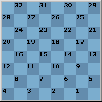
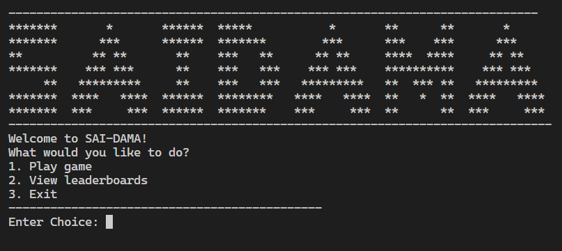
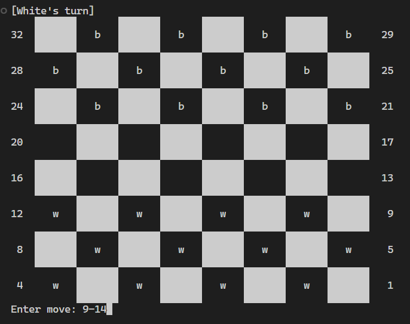
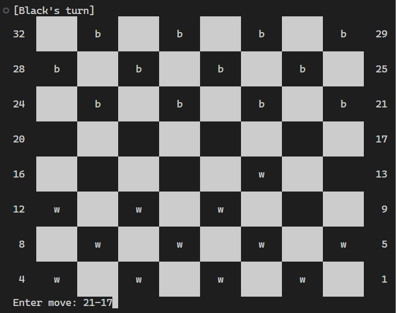
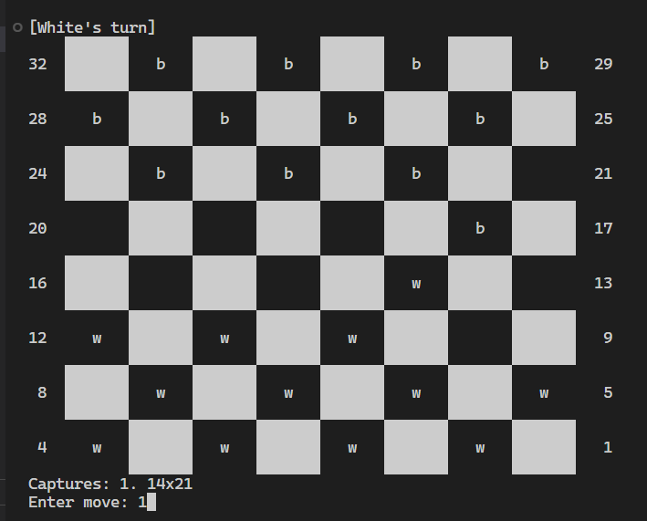
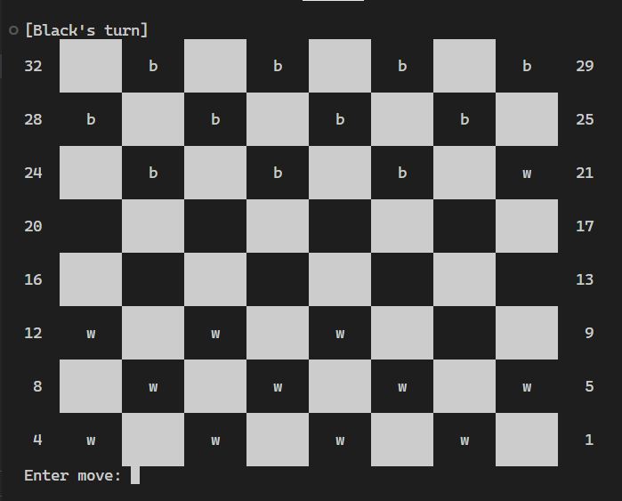
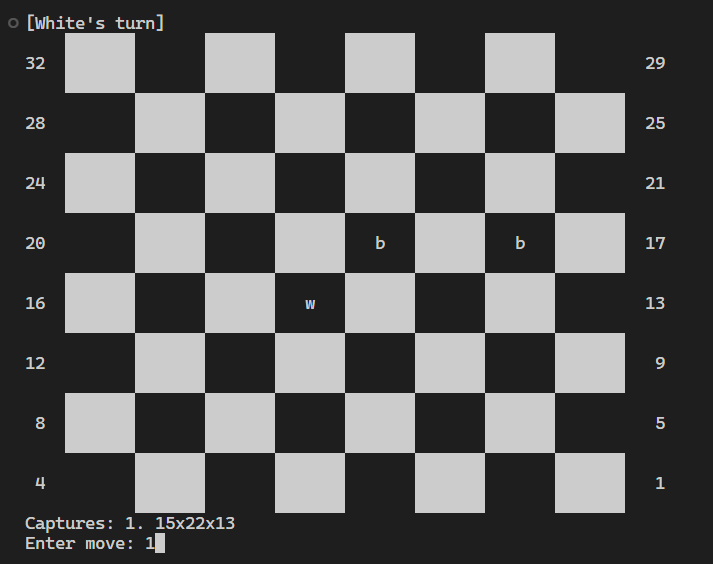
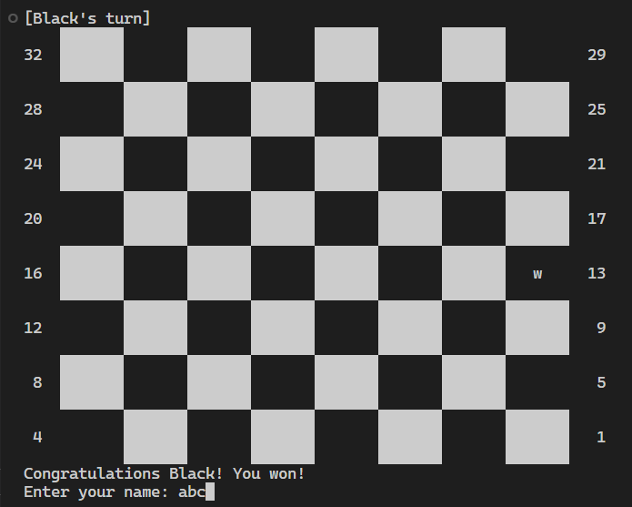

# SaiDama : Reverse checkers


By Facurib, Fernandez, Ouano, Trazona

## PROJECT OVERVIEW

<p style="text-align:justify">
SciDama is an underrated checkers-like game. Instead of depleting the opponent’s chips, your aim is to deplete your chips. It is a game where the fewer chips you have, the more chances you have at winning a round. This program aims to make the Filipino SaiDama board game playable on a computer, as well as to popularize the game.
</p>

## FEATURES

- Interactive UI
- Chessboard display
- Easy-to-read game manual
- Offline 2 player game
- Leaderboards

## RULES AND MECHANICS

1. The first player to start the game and initiate a move will be the one who picks the white chips, which will be decided by the two players. 
2. Any invalid input will be discarded. In particular, the program will keep on asking the user for another input until the input is right.
3. The winner of the game is the first player to have all its chips consumed by the opponent. 
4. Consequently, the winning player will earn a placement in the leaderboard after the game.


## HOW TO COMPILE/RUN THE PROGRAM
### Compiling
#### Compile in VS Code Terminal
```sh
gcc main.c captures.c game.c leaderboard.c move.c utils.c -o saidama
```

### Running
#### Windows
```cmd
saidama.exe
```

#### Linux:
```sh
./saidama
```
#### Gameplay
- Take note of the following board

<div style="text-align: center;">



</div>

1. The Title Screen as shown below will give you three choices, to **start the game, view the leaderboards, and exit**. The user may freely choose which one would they like to do while the title screen is up.

<div style="text-align: center;">



</div>

2. The white player has chips **w** or **W** depending if the chip is promoted. The black player also has chips **b** and **B**, respectfully.
3. When performing a move, the player in turn chooses the chip based on its coordinate appended by a '-', which is followed by its intended place. For instance: the move/input **6-9** implies that the chip on the 6th position will be moved to the 9th position as shown in the diagram below.
4. A player cannot avoid a capture of an enemy chip. If the player in turn has captures, the game will list them for the use of the player. The player then inputs the number they want to implement as a move. \
**(e.g. 1.10x17x26 2. 10x19, which the player inputs 2 for the less chance of losing)**
5. A white chip is promoted when it reaches the first row of the board *(29 to 32)* and a black piece is promoted when it reaches the last row of the board *(1 to 4)*. A promoted chip can move backward, skip multiple spaces, and capture chips that are in the same diagonal.
6. The first player who loses all their chips wins the round.
7. The winning player will have to input their name to add their wins in the database.

## SAMPLE INPUT/OUTPUT

# Title Screen
<div style="text-align: center;">


</div>

# Scenario 1 : Moving and Capturing
<div style="text-align: center;">





</div>

# Scenario 2: Winning and Adding name to leaderboards 
<div style="text-align: center;">




</div>

## CONCEPTS
- Arrays 
    - The chessboard is stored in a single row array with **64** elements.
    - The chessboard is printed by line, which appears to be a **2D-multidimensional** array.
- Functions
    - Functions, such as **print_leader** & **run_game_loop**, were implemented for the algorithm of the game
- Pointers 
    - Structures serve as pointers that are passed to a function.
- Structures
    - They are particularly useful in the movement of the chips, in parsing these movements, and in preserving the game-state.
- File manipulation
    - File manipulation is used to read and write the leaderboards file.
- Linked list
    - Linked lists are used to predict the capture moves in **find_captures**